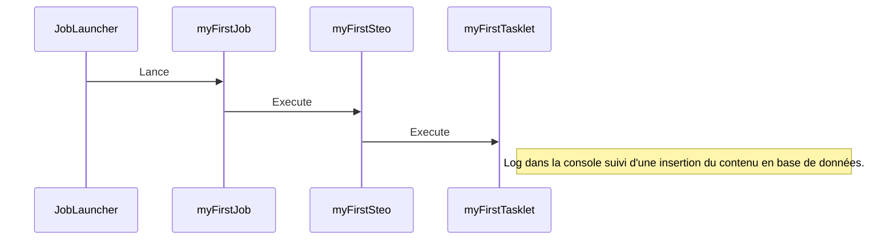

# DataSource

Suite à la lecture des _logs_ de traitement de votre premier batch, vous n'avez qu'une seule envie, c'est de comprendre le fonctionnement de cette _DataSource_ et ces fameuses _metadata_ :grin:.

Vous êtes au bon endroit :relaxed:.

## Objectif

L'objectif de cette partie sera de comprendre la configuration de _DataSource_ _Spring Batch_ via _Spring Boot_ et l'impact qu'à cette configuration sur le comportement de notre traitement.

Cette partie donnera des premiers éléments sur le modèle de données des metadatas utilisés par _Spring Batch_.

### Traitement cible

Le traitement cible change légèrement pour l'insertion en base de données du contenu du fichier texte en entrée.



### Structure Physique

Voici la structure à atteindre lors de cette partie :

```{14,22}
📦tutorial-spring-batch
┣ 📂src
┃ ┣ 📂main
┃ ┃ ┣ 📂java
┃ ┃ ┃ ┗🔸fr.goro.tutorial.spring.batch
┃ ┃ ┃   ┃  ℹ️ Package racine du code source de l'application
┃ ┃ ┃   ┗🔸firstbatch
┃ ┃ ┃     ┃  ℹ️ Package racine de notre premier batch
┃ ┃ ┃     ┣🔸config
┃ ┃ ┃     ┃  ┃  ℹ️ Package contenant la définition des @Bean Spring, les classes à développer ici sont suffixées du mode Configuration (ou Config)
┃ ┃ ┃     ┃  ┣🔸step
┃ ┃ ┃     ┃  ┃  ┃  ℹ️ Package contenant la définition  des @Bean Step
┃ ┃ ┃     ┃  ┃  ┗ 📜FirstTaskletStepConfiguration.java
┃ ┃ ┃     ┃  ┣ 📜DatasourceConfiguration.java
┃ ┃ ┃     ┃  ┗ 📜FirstBatchConfiguration.java
┃ ┃ ┃     ┣🔸tasklet
┃ ┃ ┃     ┃  ┃  ℹ️ Package contenant la logique métier des tasklets.
┃ ┃ ┃     ┃  ┗ 📜FirstTasklet.java
┃ ┃ ┃     ┗ 📜TutorialSpringBatchApplication.java
┃ ┃ ┗ 📂resources
┃ ┃   ┃  ℹ️ Resources de l'application
┃ ┃   ┗ 📜 application.yml
┃ ┣ 📂test
┃ ┃ ┣ 📂java
┃ ┃ ┃ ┃  ℹ️ Code source des tests unitaires de l'application
┃ ┃ ┃ ┗🔸fr.goro.tutorial.spring.batch
┃ ┃ ┃   ┃  ℹ️ Package racine de nos tests unitaires
┃ ┃ ┃   ┗🔸firstbatch
┃ ┃ ┃     ┗🔸tasklet
┃ ┃ ┃       ┗ 📜FirstTaskletTest.java
┃ ┃ ┗ 📂resources
┃ ┃   ┃  ℹ️ Resources des tests unitaires (jeux de données,...)
┃ ┃   ┗ 📂firstbactch
┃ ┃      ┗📝fichier_a_traiter.txt
┃ ┗ 📂it
┃   ┣ 📂java
┃   ┃ ┃ ℹ️ Code source des tests d'intégration
┃   ┃ ┗🔸fr.goro.tutorial.spring.batch
┃   ┃   ┃ ℹ️ Package racine de nos tests d'intégration
┃   ┃   ┗🔸firstbatch
┃   ┃     ┗ 📜TutorialSpringBatchFirstITCase.java
┃   ┗ 📂resources
┃     ┃ ℹ️ Resource des tests d'intégration (configuration Spring, ...)
┃     ┗ 📜application.yml
┗ 📜pom.xml
```

## Préambule

Afin de voir visuellement le résultat en base de données, nous allons modifier notre _Tasklet_ pour lui faire insérer en base de données le contenu du fichier après l'avoir loggué.

#### Modification de notre première _Tasklet_

:::caution Attention
Ce code source n'est qu'un exemple simple pour visualiser en base de données le résultat, il ne fait pas office de bon exemple.
:::

#### Modification de la configuration de notre première _Tasklet_

Nous allons simplement ajouter un attribut _DataSource_ et insérer notre contenu dans la base de données :

```jsx {7-10,16,18,21,27-28,37-43}
...
	/**
	 * Le fichier à traiter.
	 */
	private final Resource inputFile;

	/**
	 * Datasource de traitement.
	 */
	private final DataSource datasource;

    /**
     * Constructeur paramétré de MyFirstTasklet.
     *
     * @param inputFile  le fichier à traiter.
     * @param datasource la datasource de traitement.
     */
    public FirstTasklet(final Resource inputFile, final DataSource datasource) {
        Assert.notNull(inputFile, "Le fichier en entrée de la Tasklet ne peut être vide !");
        this.inputFile = inputFile;
        this.datasource = datasource;
    }

    /**
     * Méthode de traitement de {@link FirstTasklet}.
     *
     * Cette méthode logguera puis stockera en base de données le contenu du fichier
     * passé en paramétre.
     *
     */
    @Override
    public RepeatStatus execute(final StepContribution contribution, final ChunkContext chunkContext) throws Exception {
        final String message = Files.lines(inputFile.getFile().toPath()).collect(Collectors.joining("\n"));
    
        LOGGER.info(message);
    
        // Insertion en base de données.
        final PreparedStatement prepareStatement = datasource.getConnection()
            .prepareStatement("insert into info_traitement (message) values (?)");
        prepareStatement.setString(1, message);
        prepareStatement.executeUpdate();
    
        return RepeatStatus.FINISHED;
    }
```

:::tip Best Practice
Ne jamais utiliser d'annotation dans une classe de traitement. Pour un batch _Spring_, les annotations ne seront acceptées que dans la classe définissant
:::

## Configuration par défaut de la datasource Spring

Comme nous l'avons vu précédemment, _Spring Batch_ utilise par défaut une base de données _H2_ en mémoire.

:::caution Attention
Nous allons utiliser la console de la base de données H2, elle nous donnera accès à une console Web permettant d'accèder à nos données durant le _debug_ de nos traitement par exemple.

Pour pouvoir l'utiliser, nous devons ajouter la dépendance suivante au pom :

```xml		
<dependency>
    <groupId>org.springframework.boot</groupId>
    <artifactId>spring-boot-starter-web</artifactId>
</dependency>
```

C'est elle qui lancera le conteneur Web nécessaire pour l'accès à l'url de notre console _H2_ (http://localhost:8080/h2 ici en l'occurence).

Attention, néanmoins, en l'état, nous l'embarquerons pour le build final, ce qui est inutile, elle peut etre ajoutée à un profil _maven_ _dev_ ou utilisée uniquement en cas de besoin.
:::

Après l'ajout de la dépendance _spring-boot-starter-web_, nous pouvons voir ceci dans les logs :

```text {1,4,8}
o.s.b.w.embedded.tomcat.TomcatWebServer  : Tomcat initialized with port(s): 8080 (http)
o.apache.catalina.core.StandardService   : Starting service [Tomcat]
org.apache.catalina.core.StandardEngine  : Starting Servlet engine: [Apache Tomcat/9.0.52]
o.a.c.c.C.[Tomcat].[localhost].[/]       : Initializing Spring embedded WebApplicationContext
w.s.c.ServletWebServerApplicationContext : Root WebApplicationContext: initialization completed in 3124 ms
com.zaxxer.hikari.HikariDataSource       : HikariPool-1 - Starting...
com.zaxxer.hikari.HikariDataSource       : HikariPool-1 - Start completed.
o.s.b.a.h2.H2ConsoleAutoConfiguration    : H2 console available at '/h2-console'. Database available at 'jdbc:h2:mem:5576c7a2-3acb-4f63-bdac-40e738650027'
o.s.b.c.r.s.JobRepositoryFactoryBean     : No database type set, using meta data indicating: H2
o.s.b.c.l.support.SimpleJobLauncher      : No TaskExecutor has been set, defaulting to synchronous executor.
o.s.b.w.embedded.tomcat.TomcatWebServer  : Tomcat started on port(s): 8080 (http) with context path ''
```

Une base de données a été créée : `jdbc:h2:mem:5576c7a2-3acb-4f63-bdac-40e738650027`, une console est disponible sur un _context path_ vide d'un tomcat embarqué (_embedded WebApplicationContext_) à l'url `/h2-console`.

### Découverte de la console h2

Avec la configuration précédente, voyons ce qu'il se passe si nous mettons un point d'arret lors du traitement (disons, au moment du _return_ de la méthode _execute_ de la première _Tasklet_) et que nous relançons le batch en mode _Debug_.

Rendons-nous à cette url : [http://localhost:8080/h2-console](http://localhost:8080/h2-console/]) et nous nous retrouvons face à une console Web de connexion.

|  |
|:--:|
| <b>Console H2 configuré sur le path par défaut /h2-console - Login</b>|

Suivons notre configuration, et utilisons le user _sa_, avec un password vide (pensez à utiliser le bon nom de base de données `5576c7a2-3acb-4f63-bdac-40e738650027`).

|  |
|:--:|
| <b>Console H2 Up</b>|

Nous avons désormais accès à une console web permettant de consulter les informations techniques de notre batch.

:::caution Attention
La console _H2_ étant hébergée sur un _tomcat_ embarquée par _Spring Boot_, elle ne sera disponible que lors du traitement batch. C'est pour cela qu'il est nécessaire de mettre un point d'arrêt pour s'y arrêter.
:::

### Découverte des _Metadata_ _Spring Batch_

Voici un extrait ci-dessous qui nous permettra de naviguer dans ce modèle technique :

|  |
|:--:|
| __Image Credits - [Figure 35. Spring Batch Meta-Data ERD](https://docs.spring.io/spring-batch/docs/current/reference/html/index-single.html#metaDataSchema)__ |

#### BATCH_JOB_INSTANCE

Il s'agit de la table principale du modèle de données.

```sql
SELECT * FROM BATCH_JOB_INSTANCE;
```

| JOB_INSTANCE_ID | VERSION | JOB_NAME | JOB_KEY |
|-----------------|---------|----------| ----------|
|        1        |    0    | myFirstJob | d41d8cd98f00b204e9800998ecf8427e |

La table nous indique qu'un batch nommé _myFirstJob_ tourne, ou a tourné.

Nous noterons son _JOB_INSTANCE_ID_ (1, il s'agit d'une base mémoire, nous aurons toujours 1, néanmoins, si les metadata sont persitées, cet _id_ sera incrémenté).

#### BATCH_JOB_EXECUTION

Il s'agit de la table contenant les informations d'exécution de _Job_.

```sql
SELECT * FROM BATCH_JOB_EXECUTION;
```

| JOB_EXECUTION_ID | VERSION | JOB_INSTANCE_ID | CREATE_TIME | START_TIME | END_TIME | STATUS | EXIT_CODE | EXIT_MESSAGE | LAST_UPDATED | JOB_CONFIGURATION_LOCATION |
|------------------|---------|-----------------|-------------|------------|----------|--------|-----------|--------------|--------------|----------------------------|
|1 | 1 | 1 | 2021-09-13 19:03:14.702 | 2021-09-13 | 01:03:14.88 | null | STARTED | UNKNOWN | 2021-09-13 01:03:14.881 |null |

La table nous apprend que le _Job_ lié au _JOB_INSTANCE_ID_ 1 est en train de tourné, que son statut de fin d'exécution est indéfini (_STATUS_ = _UNKNWON_, notre point d'arrêt à stoppé temporairement l'exécution du _Job_).

#### BATCH_JOB_EXECUTION_PARAMS

Il s'agit de la table contenant les paramètres d'exécution.

```sql
SELECT * FROM BATCH_JOB_EXECUTION_PARAMS;
```

| JOB_EXECUTION_ID | TYPE_CD | KEY_NAME | STRING_VAL | DATE_VAL | LONG_VAL | DOUBLE_VAL | IDENTIFYING |
|------------------|---------|----------|------------|----------|----------|------------|-------------|

Il s'agit d'une table très importante, _Spring Batch_ s'appuiera dessus pour le rerun d'un batch déjà exécuté.

:::info
Nous verrons plus tard dans le tutoriel comment ajouter des paramètres d'exécution.
:::

#### BATCH_JOB_EXECUTION_CONTEXT

Il s'agit de la table de contexte d'exécution de Job.

```sql
SELECT * FROM BATCH_JOB_EXECUTION_CONTEXT;
```

| JOB_EXECUTION_ID | SHORT_CONTEXT | SERIALIZED_CONTEXT |
|------------------|---------------|--------------------|
| 1 | {"@class":"java.util.HashMap"} | null |

:::info

Nous verrons plus tard dans le tutoriel comment ajouter des paramètres d'exécution.

:::

#### BATCH_STEP_EXECUTION

L'ensemble des _Step_ lancées par les jobs.

```sql
SELECT * FROM BATCH_STEP_EXECUTION;
```

| STEP_EXECUTION_ID | VERSION | STEP_NAME | JOB_EXECUTION_ID | START_TIME | END_TIME | STATUS | COMMIT_COUNT | READ_COUNT | FILTER_COUNT | WRITE_COUNT | READ_SKIP_COUNT | WRITE_SKIP_COUNT | PROCESS_SKIP_COUNT | ROLLBACK_COUNT | EXIT_CODE | EXIT_MESSAGE | LAST_UPDATED |
|-------------------|-------- |-----------|------------------|------------|----------|--------|--------------|------------|--------------|-------------|-----------------|------------------|--------------------|----------------|-----------|--------------|--------------| 
|1	| 1	| myFirstStep | 1 | 2021-09-13 19:03:14.926 | null | STARTED | 0 | 0 | 0 | 0 | 0 | 0 | 0 | 0 | EXECUTING | 2021-09-13 01:03:14.927 |

La table nous indique qu'une _Step_ lié à notre _Job_ vu précédement (_JOB_EXECUTION_ID_ = 1) nommée _myFirstStep_ est en train de tourner (_STATUS_ = _STARTED_)

Cette _Step_ n'a aucun compteur différent de 0.

:::info

Nous verrons plus tard dans le tutoriel comment utiliser les compteurs fournis par les _metadata_ de _Spring Batch_.

:::

#### BATCH_STEP_EXECUTION_CONTEXT

Il s'agit de la table de context d'exécution de _Step_.

```sql
SELECT * FROM BATCH_STEP_EXECUTION_CONTEXT;
```

| STEP_EXECUTION_ID | SHORT_CONTEXT | SERIALIZED_CONTEXT |
|-------------------|---------------|--------------------|
| 1 | {"@class":"java.util.HashMap","batch.taskletType":"fr.goro.tutorial.spring.batch.firstbatch.tasklet.FirstTasklet","batch.stepType":"org.springframework.batch.core.step.tasklet.TaskletStep"} | null |

:::info

Nous verrons plus tard dans le tutoriel comment utiliser les compteurs fournis par les _metadata_ de _Spring Batch_.

:::

## Configuration d'une datasource Spring

### Configuration YAML

Commençons par la configuration de la base de données spécifique à _Spring Batch_ :

```yaml title="application.yml"
spring:
  datasource:
    url: jdbc:h2:~/Documents/h2db/tutorialSpringBatchDb
    driverClassName: org.h2.Driver
    username: sa
    password: 
  jpa:
    database-platform: org.hibernate.dialect.H2Dialect
  h2:
    console:
      enabled: true
inputFile: file:/chemin/vers/fichier_a_traiter.txt
```

:::note
Notre base de données aura pour url une base de données H2 qui pointe vers un fichier local, que nous avons nommée springMetadata, le username par défaut est sa, aucun password.
:::

Avec cette configuration, si nous lançons notre batch, nous retrouvons ces informations dans les logs :

```text
o.a.c.c.C.[Tomcat].[localhost].[/]       : Initializing Spring embedded WebApplicationContext
w.s.c.ServletWebServerApplicationContext : Root WebApplicationContext: initialization completed in 2791 ms
com.zaxxer.hikari.HikariDataSource       : HikariPool-1 - Starting...
com.zaxxer.hikari.HikariDataSource       : HikariPool-1 - Start completed.
o.s.b.a.h2.H2ConsoleAutoConfiguration    : H2 console available at '/h2-console'. Database available at 'jdbc:h2:~/Documents/h2db/tutorialSpringBatchDb'
o.s.b.c.r.s.JobRepositoryFactoryBean     : No database type set, using meta data indicating: H2
o.s.b.c.l.support.SimpleJobLauncher      : No TaskExecutor has been set, defaulting to synchronous executor.
o.s.b.w.embedded.tomcat.TomcatWebServer  : Tomcat started on port(s): 8080 (http) with context path ''
```

Remettons un point d'arrêt dans la _Tasklet_ et relançons en mode _Debug_.

Oh ! Oh Oh Oh Oh ! ⚫

L'iDE ne s'est pas arrété dans le point d'arrêt, regardons les logs...

```text
o.s.b.a.b.JobLauncherApplicationRunner   : Running default command line with: [CommandLineJobRunner, fr.goro.tutorial.spring.batch.firstbatch.config.FirstBatchConfiguration, myFirstJob]
o.s.b.c.l.support.SimpleJobLauncher      : Job: [SimpleJob: [name=myFirstJob]] launched with the following parameters: [{}]
o.s.batch.core.job.SimpleStepHandler     : Step already complete or not restartable, so no action to execute: StepExecution: id=2, version=3, name=myFirstStep, status=COMPLETED, exitStatus=COMPLETED, readCount=0, filterCount=0, writeCount=0 readSkipCount=0, writeSkipCount=0, processSkipCount=0, commitCount=1, rollbackCount=0, exitDescription=
o.s.b.c.l.support.SimpleJobLauncher      : Job: [SimpleJob: [name=myFirstJob]] completed with the following parameters: [{}] and the following status: [COMPLETED] in 52ms
```

:::caution Attention
Un _Job_ lancé avec les mêmes paramètres (ici, aucun paramètre) ne peut être relancé que s'il n'est pas à l'état _COMPLETED_ (notamment pour pouvoir relancer un batch _FAILED_ après correction des entrants par exemple).

Il est possible de la faire sur une base de données embarquée en mémoire car celle-ci est recréée à chaque lancement du batch.
:::

Ici, nous travaillons sur une base de données en local, vous pouvez supprimer le fichier _db_ créé au chemin défini dans l'`application.yml`.

Pour parer ce comportement, et puisque nous ne nous interesserons pas à au re-run dans cette partie du tutoriel, nous allons modifier le lancement de notre batch :

```jsx {5} title="Extrait de fr.goro.tutorial.spring.batch.firstbatch.config.FirstBatchConfiguration.java"
...
@Bean
public Job myFirstJob(final JobBuilderFactory jobBuilderFactory, final Step myFirstStep) {
    return jobBuilderFactory.get("myFirstJob")
        .incrementer(new RunIdIncrementer())
        .start(myFirstStep)
        .build();
}
...
```

:::info
Nous utilisons ici un incrémenteur d'identifiant de metadata, ce qui nous permettra de relancer le batch avec les mêmes paramètres.
:::

Vous pouvez désormais relancer le batch autant de fois que vous voulez, il crééra autant d'instance de _Job_ en base de données.


## Configuration d'une seconde datasource

### Configuration YML de la seconde datasource

Nous allons modifier l'`application.yml` comme ci-dessous :

```yaml {12-17} title="application.yml
spring:
  batch: 
    jdbc:
      initialize-schema: always
      table-prefix: tutorialSpringBatchMetadata.BATCH_
  datasource:
    hikari:
      jdbcUrl: "jdbc:h2:~/Documents/h2db/tutorialSpringBatchDb;INIT=CREATE SCHEMA IF NOT EXISTS tutorialSpringBatchMetadata\\;SET SCHEMA tutorialSpringBatchMetadata"
      driver-class-name: org.h2.Driver
      username: sa
      password:
  datasourceTraitement:  
    hikari:
      jdbcUrl: "jdbc:h2:~/Documents/h2db/tutorialSpringBatchDb;INIT=CREATE SCHEMA IF NOT EXISTS tutorialSpringBatchTraitement\\;SET SCHEMA tutorialSpringBatchTraitement\\;CREATE TABLE IF NOT EXISTS tutorialSpringBatchTraitement.info_traitement (message varchar)"
      driver-class-name: org.h2.Driver
      username: sa
      password: 
inputFile: file:/home/goro/Documents/test_tuto_batch/fichier_a_traiter.txt
```

:::info
La propriété _datasourceTraitement_ est un nom défini arbitrairement, essayer d'être cohérent et parlant lors du nommage de celle-ci.
:::

### Configuration Java des datasource

La configuration d'une datasource via _Spring Boot_ est grandement simplifiée, ainsi, voici la définition de nos deux datasources :

```jsx
package fr.goro.tutorial.spring.batch.firstbatch.config;

import javax.sql.DataSource;

import org.springframework.boot.context.properties.ConfigurationProperties;
import org.springframework.boot.context.properties.EnableConfigurationProperties;
import org.springframework.boot.jdbc.DataSourceBuilder;
import org.springframework.context.annotation.Bean;
import org.springframework.context.annotation.Configuration;
import org.springframework.context.annotation.Primary;

/**
 * Classe de configuration des datasources.
 * 
 */
@Configuration
@EnableConfigurationProperties
public class DatasourcesConfiguration {

	/**
	 * Création de la datasource principale pour les metadata de Spring Batch.
	 * 
	 * @return la datasource principale.
	 */
	@Bean
	@Primary
	@ConfigurationProperties(prefix="spring.datasource.hikari")
	public DataSource datasource() {
	    return DataSourceBuilder.create().build();
	}
	
	/**
	 * Création de la seconde datasource pour les données de traitement.
	 * 
	 * @return la datasource secondaire.
	 */
	@Bean
	@ConfigurationProperties(prefix="spring.datasource-traitement.hikari")
	public DataSource secondDatasource() {
	    return DataSourceBuilder.create().build();
	}

}
```

:::info
- Il est important de préciser à _Spring Batch_ une _@Primary_ datasource, c'est celle qui sera utilisé pour la création des metadata.

- Lors de l'utilisation de _@ConfigurationProperties_ (activée par _@EnableConfigurationProperties_), il est recommandé d'ajouter cette dépendance au pom :

```xml
<dependency>
    <groupId>org.springframework.boot</groupId>
    <artifactId>spring-boot-configuration-processor</artifactId>
    <optional>true</optional>
</dependency>
```
:::

### Utilisation des datasources


### Test de l'application

## Configuration Mono datasource Specifique Schéma
TODO

## Conclusion

TODO
