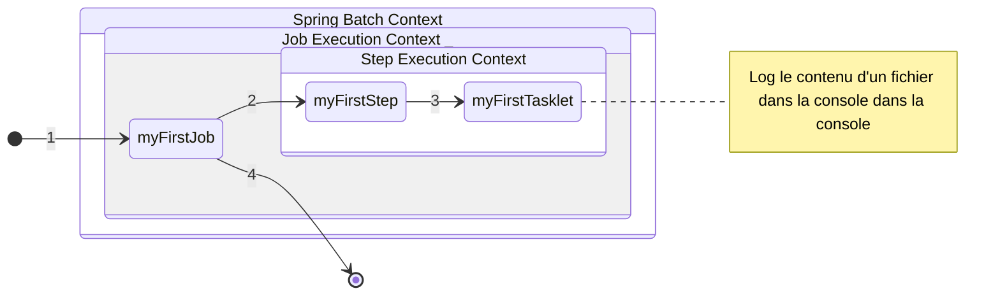

# Mon premier Job

## Objectifs

L'objectif de ce TP sera de créer un _batch_ composé d'une seule _Step_ elle même composée d'une _Tasklet_.

Cette _Tasklet_ devra lire un fichier en entrée à partir d'un chemin absolu défini dans le fichier de configuration de l'application et logguer son contenu dans la console.

### Traitement cible

Voici le traitement à mettre en place.



1. Lancement de notre _Job_ via _Launcher_ ou _Command Line_.
2. Lancement de notre _Step_ via notre _Job_.
3. Lancement de note _Tasklet_ via notre _Step_.
   1. Log dans la console.
4. Fin de traitement.
### Structure Physique

Voici la structure à atteindre lors de cette partie :

```text {5-21}
📦tutorial-spring-batch
┣ 📂src
┃ ┣ 📂main
┃ ┃ ┣ 📂java
┃ ┃ ┃ ┗🔸fr.goro.tutorial.spring.batch
┃ ┃ ┃   ┃  ℹ️ Package racine du code source de l'application
┃ ┃ ┃   ┣🔸firstbatch
┃ ┃ ┃   ┃ ┃  ℹ️ Package racine de notre premier batch 
┃ ┃ ┃   ┃ ┣🔸config
┃ ┃ ┃   ┃ ┃  ┃ ℹ️ Package contenant la définition des @Bean Spring, les classes à développer ici sont suffixées du mode Configuration (ou Config)
┃ ┃ ┃   ┃ ┃  ┣🔸step
┃ ┃ ┃   ┃ ┃  ┃  ┃ ℹ️ Package contenant la définition  des @Bean Step
┃ ┃ ┃   ┃ ┃  ┃  ┗ 📜FirstTaskletStepConfiguration.java
┃ ┃ ┃   ┃ ┃  ┗ 📜FirstBatchConfiguration.java
┃ ┃ ┃   ┃ ┗🔸tasklet
┃ ┃ ┃   ┃  ┃ ℹ️ Package contenant la logique métier des tasklets.
┃ ┃ ┃   ┃  ┗ 📜FirstTasklet.java
┃ ┃ ┃   ┗ 📜TutorialSpringBatchApplication.java
┃ ┃ ┗ 📂resources
┃ ┃   ┃ ℹ️ Resources de l'application
┃ ┃   ┗ 📜application.yml
┃ ┣ 📂test
┃ ┃ ┣ 📂java
┃ ┃ ┃  ℹ️ Code source des tests unitaires de l'application
┃ ┃ ┗ 📂resources
┃ ┃     ℹ️ Resources des tests unitaires (jeux de données,...)
┃ ┗ 📂it
┃   ┣ 📂java
┃   ┃   ℹ️ Code source des tests d'intégration
┃   ┗ 📂resources
┃       ℹ️ Resource des tests d'intégration (configuration Spring, ...)
┗ 📜pom.xml
```

:::caution Attention
La structure de package présentée ici n'est qu'un exemple, il convient de l'adapter en fonction des clients / besoin.
:::

## Préambule

On retrouve dans le code source (`src/main/java`) deux sous packages principaux :

- config 
  - Il contiendra **uniquement des méthodes permettant la définition de _@Bean_ _Spring_**
  - Il pourra contenir des fichiers suffixés de _Configuration_ (ou _Config_) pour la définition des _@Bean_ et _Properties_ (ou _Property_) pour la définition d'objet de propriétés définies dans l'_application.yml_
  - Il ne contiendra aucune logique métier, uniquement de la définition de _@Bean_ / properties.
  - On s'appuiera autant que possible sur des _class_ _Spring_ afin de minimiser le code source à développer au sein des autres _package_

:::tip Best Practice
- Ce package est la base de notre traitement, c'est dans ce package que nous définirons les objets (`@Bean`) que _Spring Batch_ devra utiliser pour réaliser le traitement.
- On utilise autant que possible des objets _Spring Batch_ pour définir nos `@Bean`.
:::

- tasklet
  - Il contiendra uniquement le développement métier de nos _tasklets_.
  - Une _tasklet_ implémente l'interface _Spring_ `Tasklet` et est suffixée de _Tasklet_.

:::danger Bad Practice
- Ne jamais utiliser d'annotation dans une classe de traitement. Pour un batch _Spring_, les annotations ne seront acceptées que dans la classe main du batch, ainsi que dans le package _config_.
:::

Nous découvrirons d'autres _package_ dans les différentes parties du tutoriel.

## Configuration YAML / Bundle (properties)

:::tip Best Practice 
Spring charge automatiquement les propriétés déclarées dans l'application.yml ou l'application.properties présent dans son `classpath`, autant l'utiliser !
:::

Commençons par la configuration _YAML_ (au format YML). Nous allons y déclarer le chemin vers un fichier à lire.

```yaml title="application.yml"
inputFile: /chemin/vers/fichier_traiter.txt
```

:::caution Attention
Le chemin contenu dans la variable `inputFile` doit être modifié. Vous pouvez créer un dossier spécifique pour ce tutorial, puis sous dossier pour ce batch (ex : ~/Documents/tutoriel_springbatch/firstbatch_).
:::

Une fois le fichier créé, nous allons pouvoir créer notre tasklet.

## Première Tasklet

La tasklet lira simplement le contenu d'un fichier et le logguera en info (par défaut, dans la sortie standard : notre bonne vieille console !).

Le traitement d'une tâche type _Tasklet_ étant propre à un besoin précis, il n'existe pas d'implémentation prévu par le framework, de ce fait, une _tasklet_ doit définir la méthode _execute_ de l'interface `Takslet`.

<details>
<summary>
<a class="btnfire small stroke"><em class="fas fa-chevron-circle-down">Voir le code source</em></a>
</summary>

```jsx title="fr.goro.tutorial.spring.batch.firstbatch.tasklet.FirstTasklet.java"

package fr.goro.tutorial.spring.batch.firstbatch.tasklet;

import java.nio.file.Files;
import java.util.stream.Collectors;

import org.slf4j.Logger;
import org.slf4j.LoggerFactory;
import org.springframework.batch.core.StepContribution;
import org.springframework.batch.core.scope.context.ChunkContext;
import org.springframework.batch.core.step.tasklet.Tasklet;
import org.springframework.batch.repeat.RepeatStatus;
import org.springframework.core.io.Resource;
import org.springframework.util.Assert;

/**
 * Classe Première Tasklet, elle ne fera que logguer le contenu d'un fichier via log4j.
 */
public class FirstTasklet implements Tasklet {

    /**
     * Logger Slf4j/Logback (logger par défaut) de la classe {@link FirstTasklet}.
     */
    private static Logger LOGGER = LoggerFactory.getLogger(FirstTasklet.class);

    /**
     * Le fichier à traiter.
     */
    private final Resource inputFile;

    /**
     * Constructeur paramétré de MyFirstTasklet.
     *
     * @param inputFile le fichier à traiter.
     */
    public FirstTasklet(final Resource inputFile) {
    	Assert.notNull(inputFile, "Le fichier en entrée de la Tasklet ne peut être vide !");
        this.inputFile = inputFile;
    }

    /**
     * Méthode de traitement de {@link FirstTasklet}.
     *
     * Cette méthode logguera uniquement le contenu du fichier passé en paramétre.
     *
     */
    @Override
    public RepeatStatus execute(final StepContribution contribution, final ChunkContext chunkContext) throws Exception {
        LOGGER.info(Files.lines(inputFile.getFile().toPath()).collect(Collectors.joining("\n")));
        return RepeatStatus.FINISHED;
    }
}

```

:::note
- Utilisation du logguer par défaut ([logback](https://logback.qos.ch/manual/introduction.html) via le `Logger` de [_slf4j_](http://www.slf4j.org/manual.html)) en constante.
- Déclaration d'une `Resource` _Spring_, le fichier sur lequel notre _Tasklet_ devra travailler.
- Le constructeur prend en paramètre le fichier en entrée, en bonne pratique ici, nous vérifions que la resource passée en paramètre est non _null_. Pour ce genre de contrôle technique,`Assert` de _Spring Batch_ fait très bien l'affaire.
- L'implémentation du code métier de notre _Tasklet_, ici: 
  - Elle loggue en _info_ le contenu du fichier `Resource` de notre _Tasklet_.
  - Elle indique qu'elle a terminé le traitement.
:::

</details>

## Première Step

Une _class_ de configuration _Spring_ est annotée d'une annotation **`@Configuration`** qui indique au framework de mettre à disposition du traitement les **`@Bean`** qui y sont définis.

Une **_Step_** est un **`@Bean`** de type **`Step`**, pour notre exemple ici, elle ne fera qu'exécuter notre _tasklet_.

Une **_tasklet_** est un **`@Bean`** de type **`Tasklet`**, il s'agira de retourner une nouvelle instance de la _tasklet_ que nous avons développé plus tôt.

<details>
<summary>
<a class="btnfire small stroke"><em class="fas fa-chevron-circle-down">Voir le code source</em></a>
</summary>

```jsx title="fr.goro.tutorial.spring.batch.firstbatch.config.step.FirstTaskletStepConfiguration.java"

package fr.goro.tutorial.spring.batch.firstbatch.config.step;

import org.springframework.batch.core.Step;
import org.springframework.batch.core.configuration.annotation.StepBuilderFactory;
import org.springframework.batch.core.step.tasklet.Tasklet;
import org.springframework.beans.factory.annotation.Value;
import org.springframework.context.annotation.Bean;
import org.springframework.context.annotation.Configuration;
import org.springframework.core.io.Resource;

import fr.goro.tutorial.spring.batch.firstbatch.tasklet.FirstTasklet;

/**
 * Classe de configuration de notre première {@link Step} composée d'une {@link Tasklet} {@link FirstTasklet}.
 *
 */
@Configuration
public class FirstTaskletStepConfiguration {

	/**
	 * Définition de la step de lecture de fichier.
	 *
	 * @param stepBuilderFactory la factory de construction de {@link Step}.
	 * @param myFirstTasklet notre première {@link Tasklet} de lecture de fichier.
	 * @return notre première {@link Step} composé de notre première {@link Tasklet}.
	 */
    @Bean
    public Step myFirstStep(final StepBuilderFactory stepBuilderFactory, final Tasklet myFirstTasklet) {
        return stepBuilderFactory
                .get("myFirstStep")
                .tasklet(myFirstTasklet)
                .build();
    }

    /**
     * Définition de notre première {@link Tasklet} de lecture de fichier.
     *
     * @param directoryPath la {@link Resource} dont le path est issu du fichier de configuration.
     * @return notre première {@link Tasklet} configurée.
     */
    @Bean
    public Tasklet myFirstTasklet(@Value("${inputFile}") final Resource directoryPath) {
        return new FirstTasklet(directoryPath);
    }

}

```

:::note
- Nous avons nommé notre classe _FirstTaskletStep**Configuration**_ car elle contiendra la configuration de toute notre première _step_. Il convient de nommer correctement les classes de configuration en se référant aux normes en vigueurs liées à votre environnement de développement.
- On y retrouve la déclaration de deux `@Bean` **nommé précisément (nom de méthode)**:
  - **myFirstStep**
    - La méthode de définition prend deux paramètres :
      - un `StepBuilderFactory`, notre constructeur de _step_, il est injecté automatiquement par le framework.
      - une `Tasklet` nommé _**myFirstTasklet**_.
    - A partir de ces paramètres, la factory créé la `Step` (composé de la _tasklet_, via _.tasklet()_) qu'il nommera _myFirstStep_ (_get("myFirstStep")_) dans son contexte.
  - **myFirstTasklet**
    - La méthode de définition prend un paramètre :
      - une `Resource` injectée automatiquement par le framework, qui se basera sur le path défini dans la variable _**inputFile**_.
:::

</details>

## Premier Job

Il s'agit toujours d'une classe de configuration, elle sera donc annotée de **_@Configuration_** et contiendra la définition de **_@Bean_**

Un **_Job_** est un **`@Bean`** de type **`Job`**, pour notre exemple, il ne fera qu'exécuter notre première _step_.

<details>
<summary>
<a class="btnfire small stroke"><em class="fas fa-chevron-circle-down"></em>Voir la soluce</a>
</summary>

```jsx title="fr.goro.tutorial.spring.batch.firstbatch.config.FirstBatchConfiguration.java"

package fr.goro.tutorial.spring.batch.firstbatch.config;

import org.springframework.batch.core.Job;
import org.springframework.batch.core.Step;
import org.springframework.batch.core.configuration.annotation.EnableBatchProcessing;
import org.springframework.batch.core.configuration.annotation.JobBuilderFactory;
import org.springframework.context.annotation.Bean;
import org.springframework.context.annotation.Configuration;

/**
 * Configuration global du batch.
 */
@Configuration
@EnableBatchProcessing
public class FirstBatchConfiguration {

    /**
     * Définition de notre {@link Job}.
     *
     * @param jobBuilderFactory la factory de construction de {@link Job}
     * @param myFirstStep notre première {@link Step} composée de notre première tasklet.
     * @return notre premier {@link Job} Spring Batch.
     */
    @Bean
    public Job myFirstJob(final JobBuilderFactory jobBuilderFactory, final Step myFirstStep) {
        return jobBuilderFactory.get("myFirstJob")
                .start(myFirstJob)
                .build();
    }

}

```

:::note
- Nous avons nommé notre classe _FirstBatch**Configuration**_ car elle contiendra uniquement la configuration de notre première traitement batch. Il convient de nommer correctement les classes de configuration en se référant aux normes en vigueurs liées à votre environnement de développement.
- On y retrouve la déclaration d'un `@Bean` **nommé précisément (nom de méthode)**:
  - **myFirstJob**
    - La méthode de définition prend deux paramètres :
      - un `JobBuilderFactory`, notre constructeur de _job_, il est injecté automatiquement par le framework.
      - une `Step` nommé _**myFirstStep**_.
    - A partir de ces paramètres, la factory créé le `Job` qu'il nommera _myFirstJob_ (_get("myFirstJob")_) dans son contexte.
:::

</details>

Et voila tout ! Notre premier _Job_ est terminé ! Nous pouvons désormais tester son lancement en local.

## Test de l'application

### Méthode de lancement

Plusieurs méthodes de lancement sont possibles :

#### Terminal

Via un terminal, depuis votre workspace, vous pouvez taper :

- Lancement de l'application :

```shell
java -jar target/tutorial-spring-batch-0.0.1-SNAPSHOT.jar
```

De cette manière, _Spring_ lancera l'ensemble des _Job_ qu'il trouvera.

Pour les besoins du TP, nous utiliserons le _CommandLineRunner_ proposé par _Spring Batch_, il nous permettra de lancer notre batch en précisant le fichier de configuration _Java_ utilisé et le nom du _Job_ à lancer.
[La documentation officiel de `Spring` à ce sujet](https://docs.spring.io/spring-batch/docs/current/reference/html/index-single.html#runningJobsFromCommandLine)

```shell
java -jar target/tutorial-spring-batch-0.0.1-SNAPSHOT.jar CommandLineJobRunner fr.goro.tutorial.spring.batch.firstbatch.config.FirstBatchConfiguration myFirstJob
```

```shell-session
$ ls
some output
```

```console
foo@bar:~$ whoami
foo
```

#### Launcher

La majorité des IDE propose différent Launcher permettant de lancer des applications, au choix :
- Java Application.
- Spring Boot App (dépend généralement d'un plugin supplémentaire relatif à l'IDE utilisé).

Pour les besoins du TP, nous utiliserons le `CommandLineRunner`, pensez donc à ajouter ce qui suit en argument de votre Launcher :

```text title="Paramétre de Launcher"
CommandLineJobRunner fr.goro.tutorial.spring.batch.firstbatch.config.FirstBatchConfiguration myFirstJob
```

:::tip Bonne Pratique
Prenez le temps de configurer correctement votre IDE lorsque vous étes amenés à travailler sur un même sujet :
- Utilisez un maximum de launcher pré configuré.
- Nommez les correctement pour les retrouver facilement.
- Configuré des launchers en favori sur vos sujets les plus récurrents.

Ici, on pourrait imaginer 
- un launcher _Maven_ pour exécuter un _mvn clean install_ en favori.
- un launcher _Spring Boot_ pour exécuter une application _Spring_.
- un launcher _Java_ pour exécuter un _java -jar_.
:::

### Analyse de log

```text {11,12,13,14} title="Résultat de la commande"

  .   ____          _            __ _ _
 /\\ / ___'_ __ _ _(_)_ __  __ _ \ \ \ \
( ( )\___ | '_ | '_| | '_ \/ _` | \ \ \ \
 \\/  ___)| |_)| | | | | || (_| |  ) ) ) )
  '  |____| .__|_| |_|_| |_\__, | / / / /
 =========|_|==============|___/=/_/_/_/
 :: Spring Boot ::                (v2.5.4)

INFO 192067 --- [           main] f.g.t.s.b.TutorialSpringBatchApplication : Starting TutorialSpringBatchApplication using Java 11.0.11 on goro-XPS-15-9560 with PID 192067 (/home/goro/Documents/workspace/tutorial-spring-batch/target/classes started by goro in /home/goro/Documents/workspace/tutorial-spring-batch)
INFO 192067 --- [           main] f.g.t.s.b.TutorialSpringBatchApplication : No active profile set, falling back to default profiles: default
INFO 192067 --- [           main] com.zaxxer.hikari.HikariDataSource       : HikariPool-1 - Starting...
INFO 192067 --- [           main] com.zaxxer.hikari.HikariDataSource       : HikariPool-1 - Start completed.
INFO 192067 --- [           main] o.s.b.c.r.s.JobRepositoryFactoryBean     : No database type set, using meta data indicating: H2
INFO 192067 --- [           main] o.s.b.c.l.support.SimpleJobLauncher      : No TaskExecutor has been set, defaulting to synchronous executor.
INFO 192067 --- [           main] f.g.t.s.b.TutorialSpringBatchApplication : Started TutorialSpringBatchApplication in 5.969 seconds (JVM running for 7.069)
INFO 192067 --- [           main] o.s.b.a.b.JobLauncherApplicationRunner   : Running default command line with: [CommandLineJobRunner, fr.goro.tutorial.spring.batch.firstbatch.config.FirstBatchConfiguration, myFirstJob]
INFO 192067 --- [           main] o.s.b.c.l.support.SimpleJobLauncher      : Job: [SimpleJob: [name=myFirstJob]] launched with the following parameters: [{}]
INFO 192067 --- [           main] o.s.batch.core.job.SimpleStepHandler     : Executing step: [readFile]
INFO 192067 --- [           main] f.g.t.s.b.f.tasklet.FirstTasklet         : Contenu du fichier affichier par My First Tasklet

####### ######            #####  ######  ######  ### #     #  #####     ######     #    #######  #####  #     #
   #    #     #          #     # #     # #     #  #  ##    # #     #    #     #   # #      #    #     # #     #
   #    #     #          #       #     # #     #  #  # #   # #          #     #  #   #     #    #       #     #
   #    ######            #####  ######  ######   #  #  #  # #  ####    ######  #     #    #    #       #######
   #    #                      # #       #   #    #  #   # # #     #    #     # #######    #    #       #     #
   #    #                #     # #       #    #   #  #    ## #     #    #     # #     #    #    #     # #     #
   #    #                 #####  #       #     # ### #     #  #####     ######  #     #    #     #####  #     #


               #####


#     # #     #    ####### ### ######   #####  #######    #######    #     #####  #    # #       ####### #######
##   ##  #   #     #        #  #     # #     #    #          #      # #   #     # #   #  #       #          #
# # # #   # #      #        #  #     # #          #          #     #   #  #       #  #   #       #          #
#  #  #    #       #####    #  ######   #####     #          #    #     #  #####  ###    #       #####      #
#     #    #       #        #  #   #         #    #          #    #######       # #  #   #       #          #
#     #    #       #        #  #    #  #     #    #          #    #     # #     # #   #  #       #          #
#     #    #       #       ### #     #  #####     #          #    #     #  #####  #    # ####### #######    #
INFO 192067 --- [           main] o.s.batch.core.step.AbstractStep         : Step: [readFile] executed in 47ms
INFO 192067 --- [           main] o.s.b.c.l.support.SimpleJobLauncher      : Job: [SimpleJob: [name=myFirstJob]] completed with the following parameters: [{}] and the following status: [COMPLETED] in 99ms
INFO 192067 --- [           main] com.zaxxer.hikari.HikariDataSource       : HikariPool-1 - Shutdown initiated...
INFO 192067 --- [           main] com.zaxxer.hikari.HikariDataSource       : HikariPool-1 - Shutdown completed.

```

En regardant de plus près les log (lignes surlignées) de notre application, on remarque plusieurs choses :

- Aucun profil n'est utilisé, il utilise donc celui par défaut (notre `application.yml`);

- Il demarre avec succés une base de données H2 (alors qu'on ne lui a rien dit :unamused:);

- Le batch a bien lancé le job (sans paramétre à priori), qui a lui même lancé la tasklet;

- Le bactch a terminé à l'état COMPLETED


## Conclusion

Nous avons désormais un premier _Spring Batch_ fonctionnel, que nous savons tester à la main de différente manière. 

Interessons-nous maintenant à cette mystérieuse datasource.